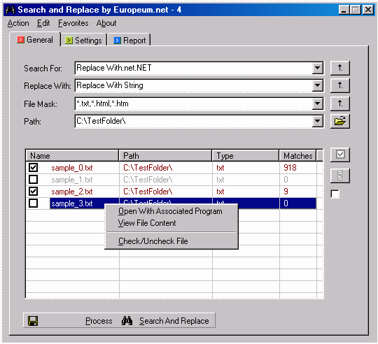

## Search & Replace \(Multiple files\)

### Description

Search and Replace is a search utility that can find and replace one or more strings in multiple files. Operations are done using regular expressions. You have a lots of options too choose from. If you like it please vote.

There is one OCX (in OCX folder) that you have to register first - it's a folder tree view.

To register the OCX use: Regsvr32 [PATH]\ccrpftv6.ocx

PS: Since PSC doesn't allow any OCX in zips you can download it here:

http://www.europeum.net/open_source/download/ccrpftv6.ocx

You need it for the folder browsing.

UPDATE:

It's the same functionality, but without any errors. Give it a try now.
 
### More Info
 

             |
---                |---
**Submitted On**   |2002-07-31 16:44:38
**By**             |[Vladimir S\. Pekulas](https://github.com/Planet-Source-Code/PSCIndex/blob/master/ByAuthor/vladimir-s-pekulas.md)
**Level**          |Intermediate
**User Rating**    |4.4 (22 globes from 5 users)
**Compatibility**  |VB 5\.0, VB 6\.0
**Category**       |[Complete Applications](https://github.com/Planet-Source-Code/PSCIndex/blob/master/ByCategory/complete-applications__1-27.md)
**World**          |[Visual Basic](https://github.com/Planet-Source-Code/PSCIndex/blob/master/ByWorld/visual-basic.md)
**Archive File**   |[Search\_&\_R113823822002\.zip](https://github.com/Planet-Source-Code/vladimir-s-pekulas-search-replace-multiple-files__1-37570/archive/master.zip)

